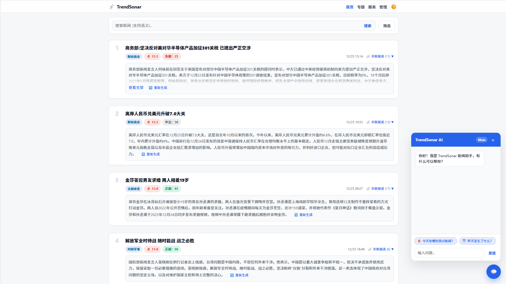
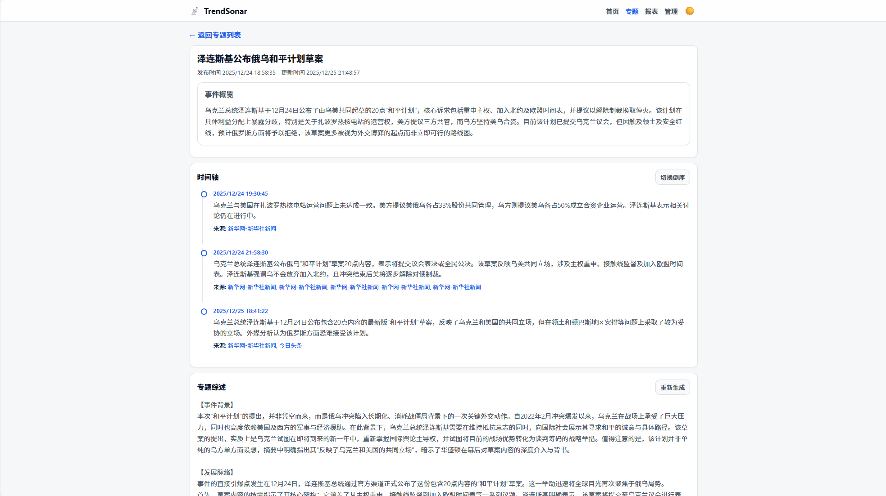
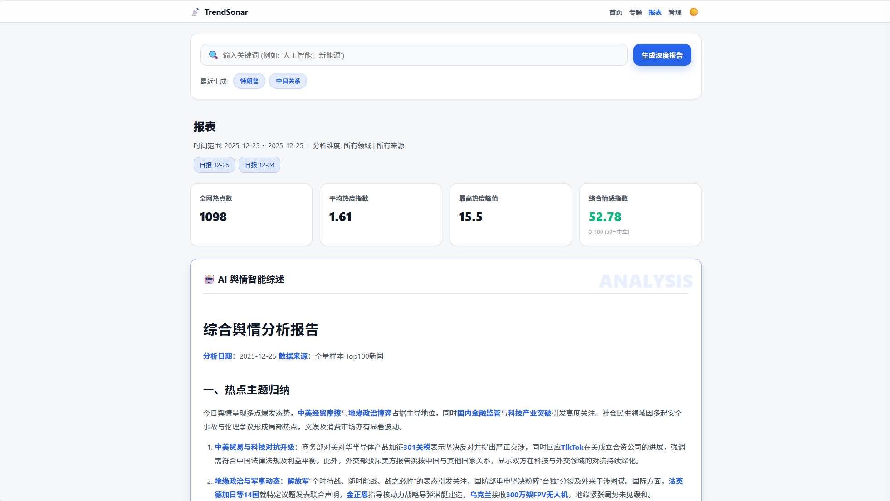
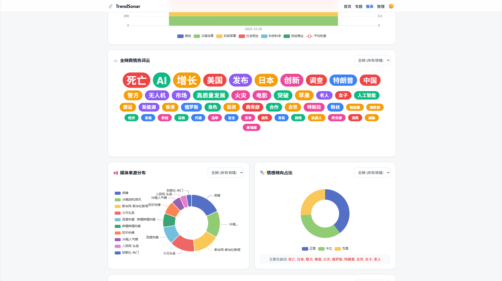

# TrendSonar

TrendSonar 是一款**智能舆情与趋势洞察系统**，旨在利用前沿的 AI 技术（LLM + Embedding）为个人和企业提供全网信息流的深度解析。

它不仅仅是一个新闻聚合器，更是一个**全天候的智能情报分析师**。通过自动化流水线，TrendSonar 能够从海量碎片化信息中提炼价值——自动识别热点、去重聚合事件、分析情感风向，并生成可视化的专题时间轴。

无论是追踪行业动态、监控品牌舆情，还是捕捉市场信号，TrendSonar 都能助你**穿透噪音，直达本质**。

## ✨ 核心特性

### 📡 全域情报捕获
- **多源异构采集**: 内置强大的爬虫引擎，支持 **RSS 订阅**、**API 对接** 及 **网页深度抓取**。
- **智能热度过滤**: 采用**权重与热度算法**，支持用户自定义新闻源权重。系统自动计算内容热度并过滤低价值噪音，确保您只看到最重要、最具影响力的新闻。
- **关键词雷达**: 内置**关键词监控**功能，您可以设置特定的关注词（如公司名、行业术语），系统将优先筛选并呈现相关动态，实现精准情报追踪。
- **灵活配置**: 可自定义关注源与屏蔽规则，轻松覆盖新闻门户、社交媒体及行业博客。

### 🧠 深度语义理解
- **智能摘要**: 摒弃机械截取，利用 LLM 生成高质量、信达雅的核心摘要，10秒读懂长文。
- **情感罗盘**: 精准识别文本的情感倾向（正面/负面/中性）与情绪烈度，量化舆论风向。
- **实体画像**: 自动提取核心实体（人名、机构、地名）与关键标签，构建信息知识图谱。

### 🔗 智能事件聚类
- **向量化去重**: 基于 **Embedding 向量模型** 计算新闻相似度，自动将同一事件的不同报道聚合归类。
- **降噪聚合**: 有效解决信息过载问题，将成百上千条碎片信息合并为一个完整的“事件卡片”。

### 📉 专题脉络追踪
- **动态时间轴**: 自动串联孤立事件，生成可视化的时间轴，清晰呈现事件的起因、经过与结果。
- **深度综述**: AI 自动撰写专题分析报告，多维度解读事件影响。

### 🛡️ 企业级架构设计
- **双模 AI 引擎**: 支持 智谱 glm-4-flash、DeepSeek、SiliconFlow 等多种模型混用，在保障性能的同时大幅降低成本。
- **自动化报表**: 支持定时生成日报、周报、关键词深度分析报告，关键信息主动推送。
- **开箱即用**: 提供标准 Docker 镜像与可视化管理后台，部署简单，维护便捷。

## 🚀 快速开始 (Docker)

我们提供了预构建的 Docker 镜像，您可以选择 Docker Compose（推荐）或 Docker CLI 进行部署。

### 准备工作

在宿主机上创建一个目录（例如 `trendsonar_data`），并在其中准备配置文件。
你需要下载 `config.yaml.example` 并重命名为 `config.yaml`，填入你的 API Key 和其他配置。

### 方式一：使用 Docker Compose (推荐)

1. 创建 `docker-compose.yml` 文件：

```yaml
version: '3.8'

services:
  trendsonar:
    image: instarsea/trendsonar
    container_name: trendsonar
    restart: always
    ports:
      - "8193:8193"
    volumes:
      # 挂载 config.yaml 到容器根目录
      - ./config.yaml:/app/config.yaml
      # 挂载 data 目录 (包含 news_sources.json 和数据库文件)
      - ./data:/app/data
    environment:
      - TZ=Asia/Shanghai
      # 【必填】管理员密码
      - ADMIN_PASSWORD=your_secure_password
```

2. 启动服务：

```bash
docker-compose up -d
```

### 方式二：使用 Docker CLI

```bash
docker run -d \
  --name trendsonar \
  -p 8193:8193 \
  -v /path/to/your/config.yaml:/app/config.yaml \
  -v /path/to/your/data:/app/data \
  -e TZ=Asia/Shanghai \
  -e ADMIN_PASSWORD=your_secure_password \
  instarsea/trendsonar
```

> **注意**：
> 1. 请将 `/path/to/your/...` 替换为实际的文件/目录路径。
> 2. `ADMIN_PASSWORD` 环境变量为**必填项**，用于设置管理后台的登录密码。

启动后，访问 `http://localhost:8193` 即可进入系统。管理后台位于 `http://localhost:8193/admin`。

## ⚙️ 配置说明

核心配置位于 `config.yaml` 文件中，主要包含：

- **数据库**: 默认使用 SQLite，支持 PostgreSQL。
- **AI 模型**:
  - `SILICONFLOW_API_KEY`: 用于 Embedding 和 Rerank (推荐 BAAI/bge-m3)。
  - `MAIN_AI_API_KEY`: 主力生成模型 (如 GLM-4)。
  - `BACKUP_AI_API_KEY`: 备用生成模型 (如 DeepSeek)。
- **抓取设置**: 可配置抓取间隔、忽略域名等。

更多详细配置项请参考 `config.yaml.example` 文件中的注释。

## 📚 推荐新闻源

如果您需要添加更多高质量的新闻源（RSS），推荐参考以下开源项目或服务获取订阅链接：

- **[Hot News](https://github.com/orz-ai/hot_news)**: 每日热点新闻聚合。
- **[NewsNow](https://github.com/ourongxing/newsnow)**: 实时热点聚合，提供多平台的热榜 RSS 接口。
- **[RSSHub](https://github.com/DIYgod/RSSHub)**: 万物皆可 RSS，为海量网站提供 RSS 生成服务。
- **[AnyFeeder](https://plink.anyfeeder.com/)**: 另一个强大的 RSS 源聚合服务。


## 📸 界面预览

### 📊 趋势仪表盘


### 🕸️ 专题脉络


### 📑 深度报表
<div align="center">
  
  
</div>

## 🌟 Star History

[](https://www.star-history.com/#aicezam/trendsonar&Date)
