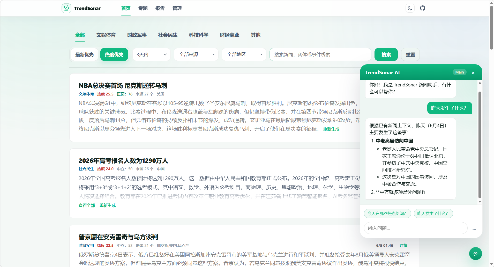
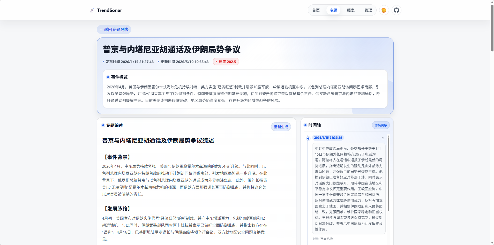
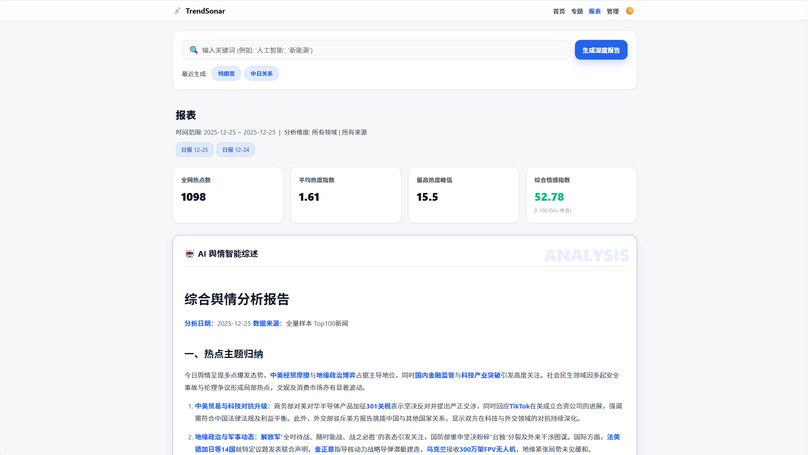
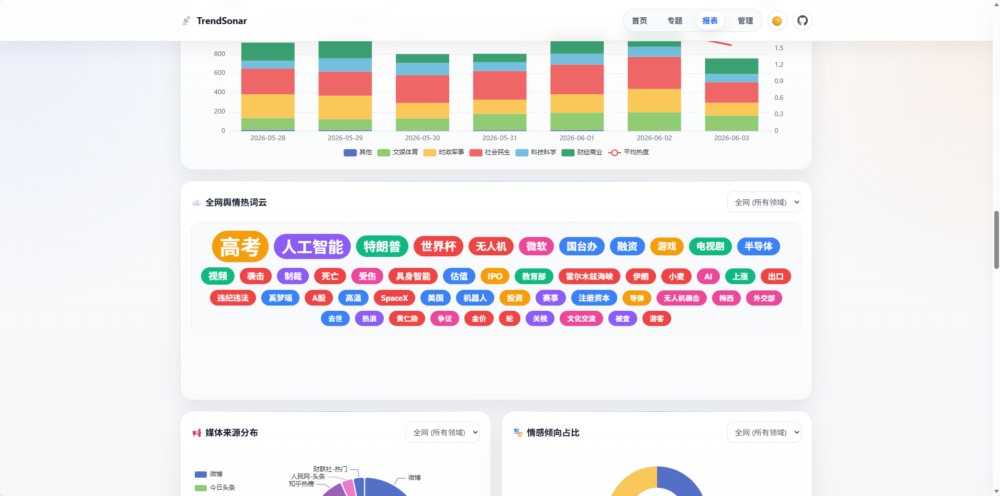

# TrendSonar

TrendSonar 是一个用于新闻热点聚合、事件去重、专题追踪和舆情报告生成的 Web 工具。它从配置的新闻源中抓取内容，结合 Embedding 与大模型能力，对新闻进行摘要、分类、情感分析、关键词提取和专题整理。

项目适合用来搭建个人或团队内部的资讯观察台，例如跟踪行业动态、观察公共事件进展、整理关键词相关报道等。分析结果会受到新闻源质量、模型能力、配置参数和数据积累时间影响，建议将其作为辅助阅读与整理工具，而不是直接替代人工判断。

## 在线演示

体验地址：[https://ainews.izam.cn](https://ainews.izam.cn)

## 主要功能

### 新闻采集与入库

- 支持通过 `news_sources.json` 配置多个新闻源。
- 兼容 RSS/XML 与 JSON 接口类数据源。
- 支持来源权重、启用状态和忽略域名配置。
- 可在需要时补抓新闻正文，用于摘要和后续分析。

### 热点列表与检索

- 按热度或时间展示新闻列表。
- 支持时间范围、分类、地区、来源等筛选。
- 支持关键词搜索，并在可用时结合向量相似度提升召回效果。
- 可生成热点新闻图片，便于分享或归档。

### AI 辅助分析

- 为热点新闻生成摘要。
- 对新闻进行分类、情感倾向分析、关键词和实体提取。
- 支持主力模型、备用模型和按功能模块配置 AI 路由。
- AI 输出质量依赖所使用的模型和提示词配置，重要结论建议复核原文。

### 事件聚合与专题追踪

- 使用 Embedding 相似度和 AI 核验，对同一事件的多来源报道进行合并。
- 根据近期热点新闻生成专题，并维护专题时间轴。
- 支持手动新增、编辑、删除专题。
- 专题筛选门槛、召回范围、更新时间窗口等参数可在配置文件中调整。

### 报告与图表

- 支持日报、周报、月报和关键词报告。
- 提供来源分布、词云、情感分布、趋势图、相关新闻等图表数据。
- 可缓存历史报告，便于回看和对比。

### 管理与配置

- 提供管理后台，用于维护配置、提示词、任务和专题。
- 支持 SQLite，配置 PostgreSQL 后也可使用 PostgreSQL。
- 提供 Docker 镜像，适合快速部署。

## 快速开始（Docker）

推荐使用 Docker Compose 部署。启动前需要准备配置文件和新闻源文件。

### 准备文件

在部署目录下创建 `data` 目录，并准备以下文件：

- `data/config.yaml`：运行配置，可参考仓库中的 `docker/data/config.yaml`。
- `data/news_sources.json`：新闻源配置，可参考仓库中的 `docker/data/news_sources.json` 或 `data/news_sources.json`。

需要重点修改的配置包括：

- `SILICONFLOW_API_KEY`：用于 Embedding。
- `MAIN_AI_API_KEY` / `MAIN_AI_BASE_URL` / `MAIN_AI_MODEL`：主力生成模型。
- `BACKUP_AI_API_KEY` / `BACKUP_AI_BASE_URL` / `BACKUP_AI_MODEL`：备用生成模型。
- `ADMIN_PASSWORD`：管理员密码，推荐通过环境变量设置。

### 使用 Docker Compose

创建 `docker-compose.yml`：

```yaml
version: '3.8'

services:
  trendsonar:
    image: instarsea/trendsonar
    container_name: trendsonar
    restart: always
    ports:
      - "8193:8193"
    volumes:
      - ./data/config.yaml:/app/config.yaml
      - ./data:/app/data
    environment:
      - TZ=Asia/Shanghai
      - ADMIN_PASSWORD=your_secure_password
```

启动服务：

```bash
docker-compose up -d
```

启动后访问：

- 首页：`http://localhost:8193`
- 管理后台：`http://localhost:8193/admin`

### 使用 Docker CLI

```bash
docker run -d \
  --name trendsonar \
  -p 8193:8193 \
  -v /path/to/your/data/config.yaml:/app/config.yaml \
  -v /path/to/your/data:/app/data \
  -e TZ=Asia/Shanghai \
  -e ADMIN_PASSWORD=your_secure_password \
  instarsea/trendsonar
```

请将 `/path/to/your/data` 替换为实际目录路径。

## 本地运行（可选）

如果希望直接从源码运行：

```bash
pip install -r requirements.txt
python main.py
```

本地运行同样需要准备 `config.yaml` 和 `data/news_sources.json`。正文抓取依赖 Crawl4AI，首次运行可能需要额外安装浏览器相关依赖；如果只是部署使用，Docker 方式更省心。

## 配置说明

核心配置位于 `config.yaml`，常用项包括：

- **数据库**：`DATABASE_URL`，默认可使用 SQLite。
- **模型配置**：Embedding、主力生成模型、备用生成模型及并发数。
- **AI 路由**：`AI_ROUTE`，可为摘要、情感分析、聚类、专题、报告等任务指定使用 `main` 或 `backup`。
- **采集与调度**：`SCHEDULE_INTERVAL_MINUTES`、`CRAWLER_CONCURRENCY`。
- **聚类参数**：`CLUSTERING_THRESHOLD`、`CLUSTERING_TIME_WINDOW_HOURS`。
- **关键词过滤**：`FOLLOW_KEYWORDS`、`FOLLOW_KEYWORDS_THRESHOLD`。
- **专题参数**：`TOPIC_LOOKBACK_DAYS`、`TOPIC_MIN_NEWS_COUNT`、`TOPIC_QUALITY_LEVEL` 等。
- **数据清理**：`DATA_CLEANUP_ENABLED`、`DATA_CLEANUP_MIN_HEAT`、`DATA_CLEANUP_PROTECT_DAYS`。

新闻源通过 `data/news_sources.json` 管理，每个来源通常包含：

```json
{
  "name": "来源名称",
  "weight": 1.0,
  "address": "https://example.com/rss-or-api",
  "enabled": true
}
```

## 使用建议

- 初始运行时数据较少，列表、聚类和专题效果会比较有限；运行一段时间后会更稳定。
- 新闻源失效、反爬限制或登录态过期会影响抓取结果，微博等来源可能需要配置有效 Cookie。
- 聚类和专题生成依赖阈值设置，阈值过低可能误合并，阈值过高可能漏合并。
- 报告和摘要是辅助信息，涉及业务、法律、投资等重要判断时应回看原文并人工确认。

## 推荐新闻源

如果需要扩展 RSS 或热点来源，可以参考：

- [Hot News](https://github.com/orz-ai/hot_news)：每日热点新闻聚合。
- [NewsNow](https://github.com/ourongxing/newsnow)：多平台热榜聚合，提供部分 RSS/API 接口。
- [RSSHub](https://github.com/DIYgod/RSSHub)：为许多网站生成 RSS。
- [AnyFeeder](https://plink.anyfeeder.com/)：RSS 源聚合服务。

## 界面预览

### 热点新闻列表



### 专题追踪



### 深度报告




## Star History

[](https://www.star-history.com/#aicezam/trendsonar&type=date&legend=top-left)

## 更新日志

- **v0.1.0**：初始版本，发布至 Docker Hub。
- **v0.1.1**：修复部分鉴权问题。
- **v0.1.2**：优化配置异常时的定时任务流程。
- **v0.1.3**：优化内存占用，优化专题追踪模块的复核逻辑。
- **v0.1.4**：新增专题质量审核等级配置，优化专题生成逻辑。
- **v0.1.5**：优化专题生成逻辑，允许手动新增、编辑、删除专题。
- **v0.1.6**：优化关键词深度分析交互，并允许在管理后台自定义提示词。
- **v0.1.7**：尝试优化 token 消耗、聚合流程和首页筛选交互。
- **v0.2.0**：优化 token 消耗、日志显示和专题重复生成问题。
- **v0.2.1**：专题模块新增报告功能，包括词云、来源分布、情感分析、相关新闻、关键词趋势等。
- **v0.2.5**：搜索优化、向量召回优化、专题模块新增关键词趋势分析、报告页面关键词分析、UI交互优化、新闻详情弹窗等等
- **v0.2.6**：重构UI视觉样式，优化性能，优化提示词，优化专题生成逻辑


## 许可证

本项目基于 [MIT License](LICENSE) 开源。
